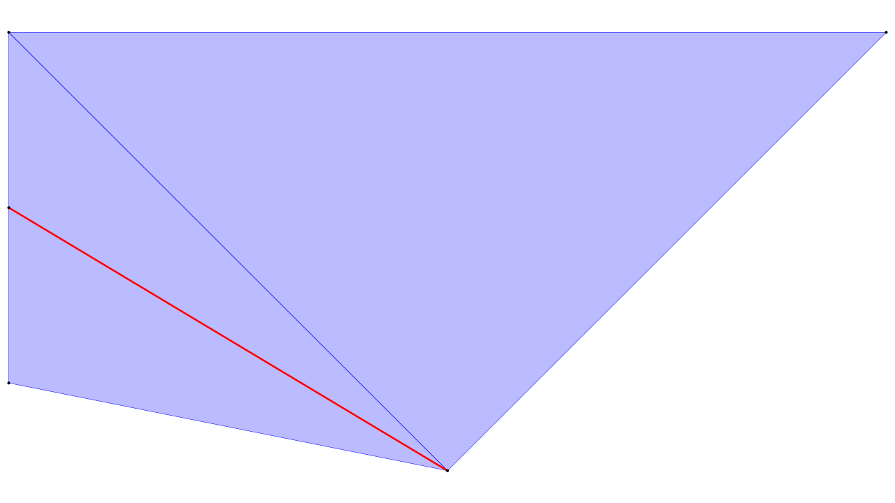
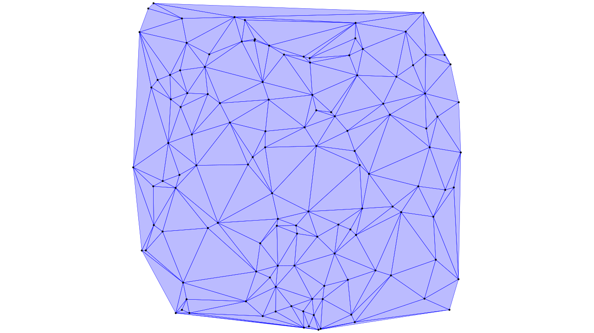
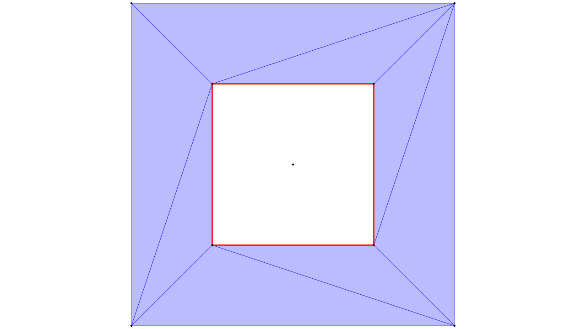
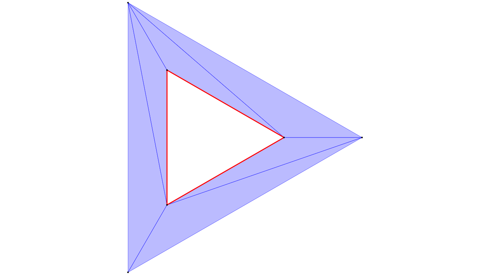
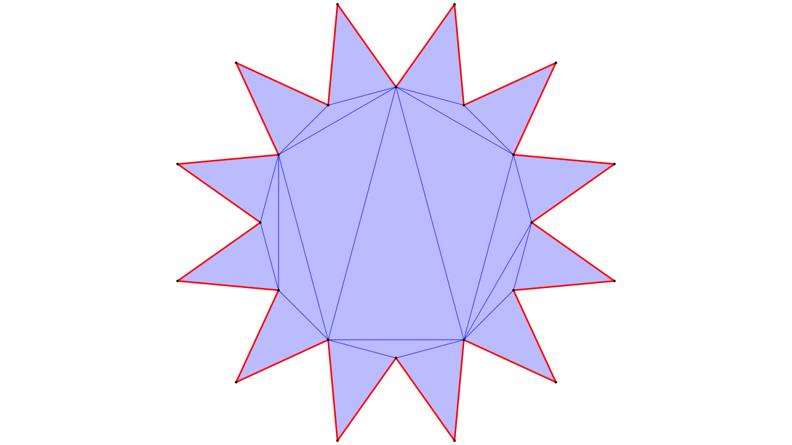

DelTri4S is a 2D constrained Delaunay Triangulation library for Scala and ScalaJS.
To that end it implements both mutable and immutable data structures
that allow the fast creation, manipulation and traversal of 2D triangle meshes.
For educational and debugging purposes, DelTri4S supports the export of triangle
mesh objects to an interactive HTML visualization. Said visualizations allow to
retrace the modifications that were made to the mesh thus helping the understanding
and debugging of algorithms.

For a demonstration of how a Constrained Delaunay Triangulation is performed,
see [this example](https://dirktoewe.github.io/DelTri4S/cdt_example.html#-1).

  * [Mesh Creation](#mesh-creation)
  * [Mesh Traversal](#mesh-traversal)
  * [Delaunay Triangulation](#delaunay-triangulation)
  * [Constrained Delaunay Triangulation](#constrained-delaunay-triangulation)

Mesh Creation
-------------
`TriMesh` is the super-type for mutable triangle meshes. A triangle mesh in DelTri4S
is composed of the following elements:

<dl>
  <dt>Nodes:<dd> Uniquely identifiable points on the 2D plane. A mesh may contain multiple
  nodes with the same coordinates but it will not be Delaunay triangulatable.
   
  <dt>Segments:<dd> Lines that are uniquely defined by a pair of Nodes. A mesh may contain
  intersecting segments but it woll not be Delaunay triangulatable. Segments are used in
  constrained Delaunay Triangulations to confine triangulated areas and to enforce that
  certain edges are part of the triangulation.

  <dt>Triangle:<dd> Triangles that are uniquely identified by a triple of Nodes with positive
  orientation. Each node pair may only be part of one triangle.
</dl>

`TriMeshIndexed` is the fastest `TriMesh` implementation available.
```scala
import deltri.TriMeshIndexed

val mesh = TriMeshIndexed.empty
val a = mesh.addNode(0,0)
val b = mesh.addNode(2,0)
val c = mesh.addNode(1,1)
mesh.addTri(a,b,c)
val d = mesh.addNode(0,0.4)
mesh.addTri(a,c,d)
val e = mesh.addNode(0,0.8)
mesh.addTri(d,c,e)
mesh.addSegment(d,c)
```



The Node objects returned by `addNode` are used to reference nodes in further
operations like adding segments or triangles. The Node object contains the x
and y coordinate but the `equals` and `hashCode` method use object identity to
compare objects. The Node objects themselves do however not contain any reference
to their mesh and do not prevent the mesh object from being garbage collected.

The `toHTML` methods returns an HTML document string containing an interactive visualization.
```scala
import java.awt.Desktop.getDesktop
import java.nio.file.Files
import java.util.Arrays.asList

val tmp = Files.createTempFile("example1_",".html")
Files.write( tmp, asList(mesh.toHtml) )
getDesktop.browse(tmp.toUri resolve "#-1")
```

`TriMeshImmutable` is an immutable/persistent triangle mesh data structure. It is roughly 50%
slower than `TriMeshIndexed` but allows for faster and simpler undo/backtracking operations and
is safely shareable without protective copying. 
```scala
val mesh1 = TriMeshImmutable.empty
val(mesh2,a) = mesh1 addedNode (0 , 0)
val(mesh3,b) = mesh2 addedNode (2 , 0)
val(mesh4,c) = mesh3 addedNode (1 , 1)
val(mesh5,d) = mesh4 addedNode (0 , 0.4)
val(mesh6,e) = mesh5 addedNode (0 , 0.8)
val mesh7    = mesh6.addedTri(a,b,c)
                    .addedTri(a,c,d)
                    .addedTri(d,c,e)
                    .addedSegment(d,c)
```
Note that the example code above can be greatly simplified by using pure functional programming
techniques, e.g. by using the State Monad, as implement for example in [Cats](https://typelevel.org/cats/datatypes/state.html)
or [ScalaZ](http://eed3si9n.com/learning-scalaz/State.html). `TriMeshMutable` is a wrapper around
`TriMeshImmutable` that allow the conversion from and to a mutable representation in O(1).

Mesh Traversal
--------------
The `adjacent` method allows fast querying of neighbor/adjacent triangles. For the nodes
`a` and `b`, `adjacent(a,b)` returns the node `c` iff there is a triangle `(a,b,c)` in
the mesh. Keep in mind that triangles in a mesh all have a positive orientation. 

```scala
val     mesh = TriMeshIndexed.empty()
val a = mesh addNode (-1, -1)
val b = mesh addNode (+1, -1)
val c = mesh addNode (+1, +1)
val d = mesh addNode (-1, +1)
mesh addTri (a,b,c)
mesh addTri (c,d,a)

assert( mesh.adjacent(a,c).exists )
assert( mesh.adjacent(a,c).nodeOrNull  eq  d )

for( e <- mesh.adjacent(a,b) )
  assert( e eq c )
```

`foreachTri` allows the traversal of all triangles in a mesh.

```scala
mesh foreachTri {
  (a,b,c) =>
    printf( "Tri(\n  %s,\n  %s,\n  %s\n)\n", a,b,c )
}
```

`foreachTriAround(a)` traverses every triangle that contains node `a`.

```scala
mesh.foreachTriAround(a){
  (b,c) =>
    printf( "Tri(\n  %s,\n  %s,\n  %s\n)\n", a,b,c )
}
```

Analogue to the aforementioned methods there is also `foreachNode`, `foreachSegement` and
`foreachSegmentAround`.

Note that the author of DelTri4S is not a pure functional programmer and most traversal operations
are not well suited for that programming paradigm. Contributions to improve that situation are of
course welcome.

Delaunay Triangulation
----------------------
The companion object of every `TriMesh` class exposes a `delaunay` method which takes a sequence
of points and returns a mesh of said class containing delaunay triangulation. `TriMeshTaped` is a
thin wrapper around a `TriMesh` that records every modification made to the mesh, which can be
inspected using `toHTML`.

```scala
val rng = new Random(1337)
val points = Array.tabulate(128){
  _ => (rng.nextDouble*2-1,
        rng.nextDouble*2-1)
}.toMap.toSeq // <- remove duplicates

val (mesh,nodes) = TriMeshTaped.delaunay(points: _*)
```



Constrained Delaunay Triangulation
----------------------------------
The input to the Constrained Delaunay Triangulation (CDT) in DelTri4S is a Piecewise Linear Complex
(PLC). A PLC consists of:

  * A sequence of `nodes: Seq[(Double,Double)]`
  * A sequence of `segments: Seq[(Int,Int)]`, where `Seq( (i,j) )` means the CDT must contain edge `(nodes(i),nodes(j))`
  * Information about holes and the boundary

Holes must be entirely enclosed by a closed chain of segments. One way to specify holes or the outside,
is to specify one or more nodes that lie inside of a hole or the outside.

```scala
val center = (0.0, 0.0)
val innerCircle = Vector range (45,405,90) map (_.toRadians) map {
  angle => ( 0.5 * Math.cos(angle),
             0.5 * Math.sin(angle) )
}
val outerCircle = Vector range (45,405,90) map (_.toRadians) map {
  angle => ( 1 * Math.cos(angle),
             1 * Math.sin(angle) )
}

val plc = PLC(
  nodes     = (innerCircle :+ center) ++ outerCircle,
  segments  =  innerCircle.indices map { i => i -> (i+1) % innerCircle.length },
  holeNodes = Set(innerCircle.length) // <- put a hole in the center
)

val (mesh, meshNodes) = TriMeshTaped.delaunayConstrained(plc)
```



Another way to specify holes is to specifiy one or more segments, to the right/positive side of which,
all triangles are to be removed.

```scala
val innerCircle = Vector range (0,360,120) map (_.toRadians) map {
  angle => ( 0.5 * Math.cos(angle),
    0.5 * Math.sin(angle) )
}
val outerCircle = Vector range (0,360,120) map (_.toRadians) map {
  angle => ( 1 * Math.cos(angle),
    1 * Math.sin(angle) )
}

val plc = PLC(
  nodes     = innerCircle ++ outerCircle,
  segments  = innerCircle.indices map { i => i -> (i+1) % innerCircle.length },
  orientedBoundarySegments = Seq( (0,1) )
)

val (mesh, meshNodes) = TriMeshTaped.delaunayConstrained(plc)
```



If the PLC is enclosed by an outer boundary of segments, `confinedBySegments` can be set to true in
the PLC and the CDT will not contain any triangles outside of the outermost segment boundary.

```scala
val innerCircle = Vector range ( 0,360,30) map (_.toRadians) map {
  angle => ( 0.6 * Math.cos(angle),
             0.6 * Math.sin(angle) )
}
val outerCircle = Vector range (15,375,30) map (_.toRadians) map {
  angle => ( 1 * Math.cos(angle),
             1 * Math.sin(angle) )
}
val n      = innerCircle.length
val points = innerCircle ++ outerCircle

val segments = innerCircle.indices flatMap { i => Seq(
   i    -> (i+n),
  (i+n) -> (i+1) % n
)}

val plc = PLC(
  points,
  segments,
  confinedBySegments = true
)

val (mesh, nodes) = TriMeshTaped.delaunayConstrained(plc)
```


